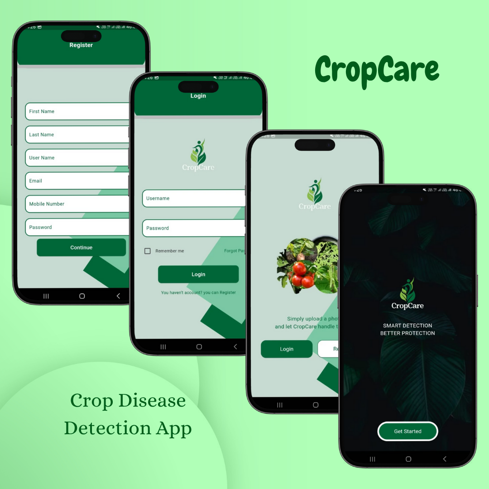

# 🌿 CropCare – Smart Farming with AI 📱🌾

    
   

**CropCare** is an **AI-powered mobile application** designed to help farmers detect diseases in their crops with the help of **machine learning** and **computer vision**. With just a photo of a leaf, farmers can get instant, accurate diagnoses — right from their phones!

> Helping farmers grow healthier crops, one leaf at a time 🌱

---

## ✨ Key Features

- ✅ **AI-Based Disease Detection**  
  Diagnose **potato**, **bean**, and **tomato** diseases using leaf images.

- ✅ **Real-Time Image Analysis**  
  Upload a leaf photo and receive instant feedback using a powerful CNN model.

- ✅ **Mobile-Friendly Interface**  
  Designed with simplicity and usability in mind for real-world users — the farmers.

---

## 🧠 Powered By

- 🔹 **Flutter** – Cross-platform mobile app development  
- 🔹 **Python + TensorFlow** – For training and running the ML model  
- 🔹 **Keras** – CNN architecture for disease classification  
- 🔹 **MongoDB** – Backend database for user and analysis data  
- 🔹 **Cloud Storage** – For managing uploaded leaf images

